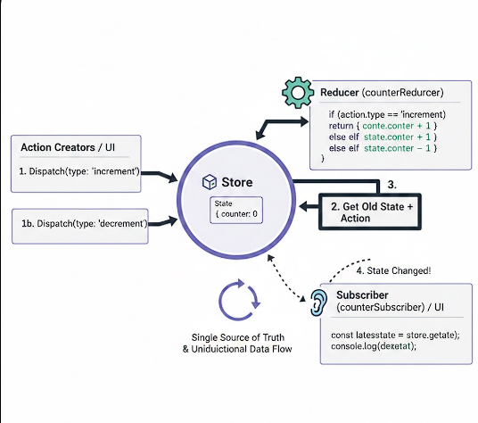

Bu proje, 
Redux’in temel kullanımını öğrenmek amacıyla hazırlanmıştır.
Redux’te action oluşturma, reducer tanımlama, store kullanma, dispatch etme ve state değişikliklerini izleme (subscribe) gibi temel yapı taşlarını uygulamalı bir şekilde inceledim.
Bu sayede Redux ile global state yönetiminin nasıl organize edildiğini daha iyi anladım.

